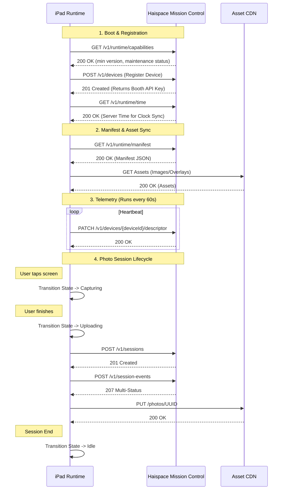

# Runtime Sequence Diagram

This diagram visualizes the communication lifecycle between the iPad Runtime and the Haispace Mission Control (Cloud) during a standard operational day.

```mermaid
sequenceDiagram
    participant Hardware as iPad Runtime
    participant Cloud as Haispace Mission Control
    participant CDN as Asset CDN

    Note over Hardware, Cloud: 1. Boot & Registration
    Hardware->>Cloud: GET /v1/runtime/capabilities
    Cloud-->>Hardware: 200 OK (min version, maintenance status)
    
    Hardware->>Cloud: POST /v1/devices (Register Device)
    Cloud-->>Hardware: 201 Created (Returns Booth API Key)
    
    Hardware->>Cloud: GET /v1/runtime/time
    Cloud-->>Hardware: 200 OK (Server Time for Clock Sync)

    Note over Hardware, Cloud: 2. Manifest & Asset Sync
    Hardware->>Cloud: GET /v1/runtime/manifest
    Cloud-->>Hardware: 200 OK (Manifest JSON)
    Hardware->>CDN: GET Assets (Images/Overlays)
    CDN-->>Hardware: 200 OK (Assets)

    Note over Hardware, Cloud: 3. Telemetry (Runs every 60s)
    loop Heartbeat
        Hardware->>Cloud: PATCH /v1/devices/{deviceId}/descriptor
        Cloud-->>Hardware: 200 OK
    end

    Note over Hardware, Cloud: 4. Photo Session Lifecycle
    Note left of Hardware: User taps screen
    Hardware->>Hardware: Transition State -> Capturing
    Note left of Hardware: User finishes
    Hardware->>Hardware: Transition State -> Uploading
    
    Hardware->>Cloud: POST /v1/sessions
    Cloud-->>Hardware: 201 Created
    
    Hardware->>Cloud: POST /v1/session-events
    Cloud-->>Hardware: 207 Multi-Status
    
    Hardware->>CDN: PUT /photos/UUID
    CDN-->>Hardware: 200 OK
    
    Note left of Hardware: Session End
    Hardware->>Hardware: Transition State -> Idle
```
