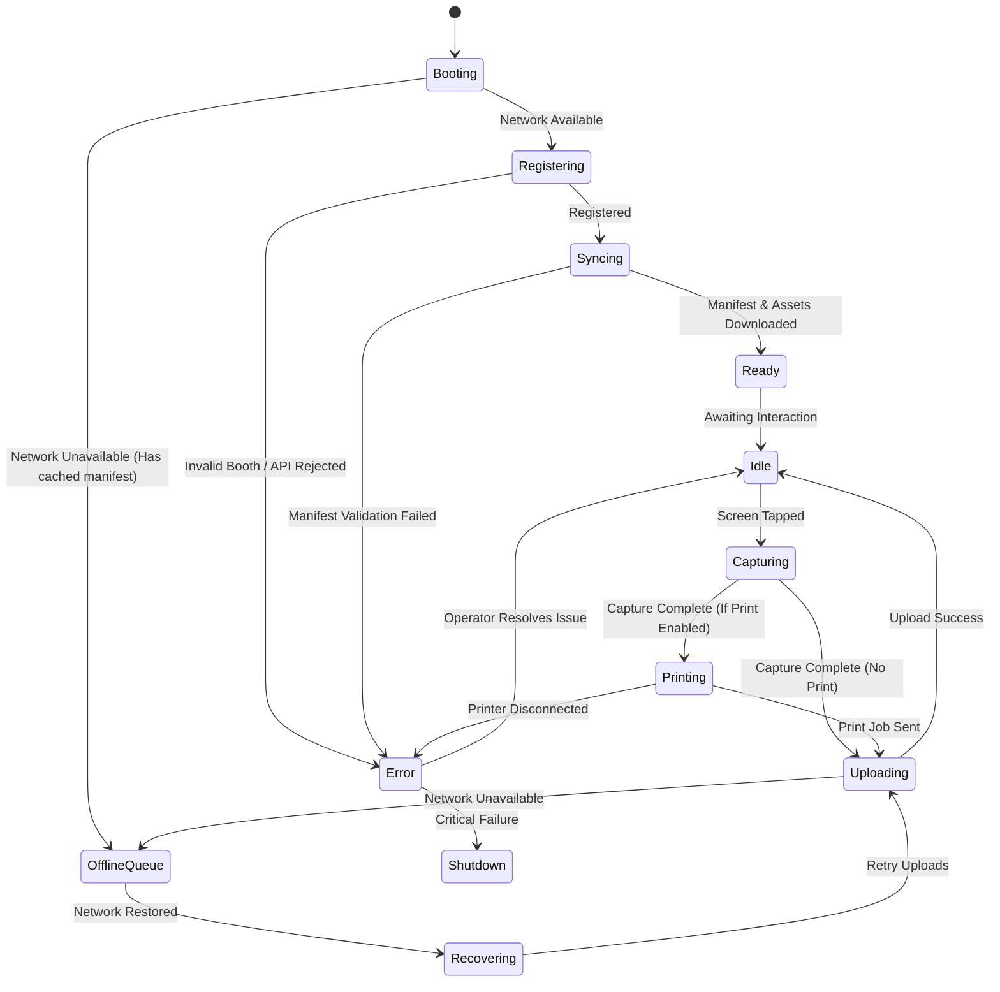

# Runtime State Machine

The Haispace Runtime follows a strict State Machine to ensure stability, especially in offline scenarios.

## State Definitions

### Booting
- **Entry Condition**: App launched.
- **Actions**: Verify hardware capabilities, check local cache.
- **Exit Condition**: Network check complete.

### Registering
- **Entry Condition**: Device needs API Key or needs to verify existing key.
- **Actions**: Calls `POST /v1/devices`.
- **Exit Condition**: Receives API Key.

### Syncing
- **Entry Condition**: Device is authenticated.
- **Actions**: Calls `GET /v1/runtime/capabilities`, `GET /v1/runtime/time`, `GET /v1/runtime/manifest`, downloads assets.
- **Exit Condition**: All assets cached locally.

### Idle
- **Entry Condition**: Manifest is loaded.
- **Actions**: Render attract screen. Send background heartbeats.
- **Exit Condition**: User interaction.

### Capturing
- **Entry Condition**: User starts session.
- **Actions**: Activate camera, run countdowns, record Domain Events.
- **Exit Condition**: Session flow complete.

### Uploading
- **Entry Condition**: Session finished.
- **Actions**: Call `POST /v1/sessions` and `POST /v1/session-events`.
- **Exit Condition**: 201/207 response received.

### Offline Queue
- **Entry Condition**: Any network call fails.
- **Actions**: Save payload to CoreData/SQLite.
- **Exit Condition**: Network reachability status changes to reachable.
